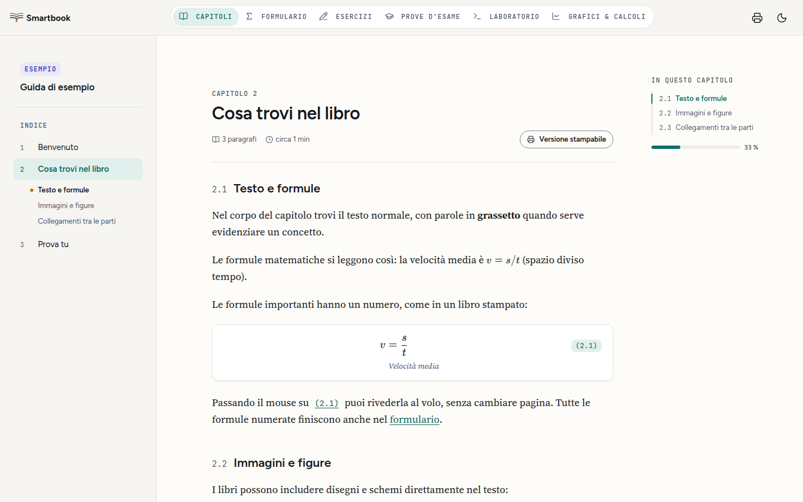

<p align="center">
  <picture>
    <source media="(prefers-color-scheme: dark)" srcset="design-system/logo/ptsb-lockup-dark.svg">
    
  </picture>
</p>

<p align="center">
  A web reader for interactive textbooks.<br>
  Open a smartbook and get its chapters, formula sheet, worked exercises, exam practice, Python lab and graphs in one place.
</p>

<p align="center">
  <a href="https://github.com/SuperTost100/politost-smartbook/actions/workflows/ci.yml"></a>
  <a href="LICENSE"></a>
</p>

<p align="center">
  <a href="docs/guida.md">Reader guide</a> ·
  <a href="docs/Self-Hosting.md">Self-hosting</a> ·
  <a href="docs/reader.md">Architecture</a>
</p>

<picture>
  <source media="(prefers-color-scheme: dark)" srcset="docs/screenshots/chapter-dark.png">
  
</picture>

## What it does

A smartbook is a course book written in Markdown with numbered formulas, exercises, exam questions, Python snippets and graphs, packed into a `.ptsb` file. Smart Builder writes them, and this reader shows them in the browser.

**Read chapters.** Formulas render with KaTeX and carry numbers like a printed book. Hovering a reference such as (2.1) shows the formula without leaving the page.

**Study from the formula sheet.** It collects every numbered formula from the chapters. Exercises and past exam questions come with hints and step-by-step solutions.

**Run code and plot.** The lab runs Python in the browser through Pyodide, plus a small MATLAB-style interpreter. Graphs are computed on the device. Neither sends code to a server.

**Print.** Chapters, the formula sheet, exercises and exams each have a print preview, with hints and solutions shown.

**Import a book.** Drop a `.ptsb` file on the home page. It stays in that browser and isn't uploaded anywhere.

The interface is in Italian, with light and dark themes. This repository ships only the example book ("Guida di esempio").

## Start

You need Node.js 22.13 or newer. CI uses 24.

```bash
git clone https://github.com/SuperTost100/politost-smartbook.git
cd politost-smartbook
npm ci          # also copies the Pyodide runtime into public/pyodide/
npm run dev     # opens on http://localhost:5173
```

Choose "Guida di esempio" to open the example book.

The default build needs no backend, account or database. `npm run build` writes a static site to `dist/`, which you can host anywhere with an SPA fallback. [Self-hosting](docs/Self-Hosting.md) has the details.

## Configuration

Copy `.env.example` to `.env.local` only if you connect the reader to the private Politost platform:

| Variable                | Default | What it does                                              |
| ----------------------- | ------- | --------------------------------------------------------- |
| `VITE_PLATFORM_ENABLED` | `false` | Turns on sign-in, licenses and cloud books                |
| `VITE_API_URL`          | empty   | Platform API address, required when the platform is on    |

Both are read at build time. The platform API and its course books live in a separate private repository.

## Checks

```bash
npm run lint
npm run test:content    # content-core parser tests plus the reader's content tests
npm run test:unit
npm run build
npm run test:e2e        # installs Playwright's Chromium on first run
```

CI runs the first four on every push. Auth tests run only with `VITE_PLATFORM_ENABLED=true`.

## Documentation

| Read this                                                                                                | To learn                                                  |
| -------------------------------------------------------------------------------------------------------- | --------------------------------------------------------- |
| [Reader guide](docs/guida.md)                                                                            | How to use the reader, in Italian. Also served at `/docs` |
| [Reader architecture](docs/reader.md)                                                                    | Routes, components and how a book loads                   |
| [Design system](design-system/README.md)                                                                 | Tokens, type, icons and the logo                          |
| [PTSB format](docs/ptsb.md)                                                                              | What a `.ptsb` file contains                              |
| [Content format](https://github.com/SuperTost100/politost-content-core/blob/main/spec/content-format.md) | The Markdown syntax books are written in                  |
| [Self-hosting](docs/Self-Hosting.md)                                                                     | Building and serving the static site                      |
| [Repository sync](docs/Repository-Sync.md)                                                               | Which repository owns what since the monorepo split       |

## Related repositories

- [politost-content-core](https://github.com/SuperTost100/politost-content-core): the content format spec, content-core (the parser, validator and PTSB reader bundled in `packages/content-core/`, MIT) and ptsb-pack (Python CLI that packs books into `.ptsb` files).
- [Smart Builder](https://github.com/SuperTost100/politost-smartbook-builder): turns lecture notes, textbooks and past exams into a smartbook. AGPL-3.0.
- [Pyxis](https://github.com/SuperTost100/politost-pyxis): a desktop study tutor that also opens `.ptsb` files.

The archived `politost-builder` is withdrawn. Don't copy code from it.

## License

[AGPL-3.0](LICENSE). The bundled content-core package has its own [MIT license](packages/content-core/LICENSE). Books you open with the reader are not covered by this license.
