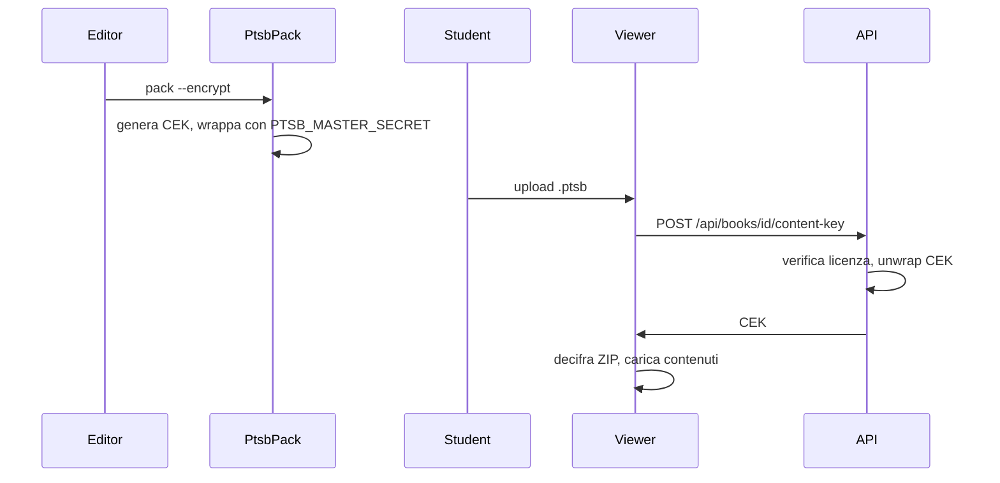

# Formato `.ptsb`

**Politost Smartbook** — pacchetto portabile di un intero libro. Contiene la stessa struttura descritta in [content-format.md](content-format.md), impacchettata per distribuzione o import nel viewer.

Implementazione: [ptsb-pack](https://github.com/SuperTost100/politost-content/tree/main/packages/ptsb-pack) (CLI Python) + script Node [`pack-ptsb.ts`](../scripts/pack-ptsb.ts) + lettura dei pacchetti in chiaro in content-core [`ptsb.ts`](../packages/content-core/src/ptsb.ts) + decifratura e import nel viewer [`ptsb.ts`](../src/lib/ptsb.ts).

---

## Indice

1. [Varianti](#1-varianti)
2. [Contenuto del pacchetto](#2-contenuto-del-pacchetto)
3. [Plain (ZIP)](#3-plain-zip)
4. [Cifrato (PTSB)](#4-cifrato-ptsb)
5. [Creare un pacchetto](#5-creare-un-pacchetto)
6. [Caricamento nel viewer](#6-caricamento-nel-viewer)
7. [DRM e chiavi](#7-drm-e-chiavi)
8. [Validazione](#8-validazione)

---

## 1. Varianti

| Variante | Magic bytes | Uso |
|----------|-------------|-----|
| **Plain** | `PK` (ZIP standard) | Sviluppo, libri pubblici, distribuzione aperta |
| **Encrypted** | `PTSB` (header binario) | `access: licensed` — richiede login e licenza |

Estensione file: `.ptsb` in entrambi i casi.

---

## 2. Contenuto del pacchetto

```
ptsb.json              # manifest formato (metadati pacchetto)
smartbook.json         # config libro (id, titolo, capitoli, access)
chapters/*.md          # obbligatorio — almeno un capitolo
esercizi.md            # opzionale
esami.md               # opzionale
ide.json               # opzionale
grafici.json           # opzionale
assets/*               # opzionale — immagini referenziate nei .md
```

Schema contenuti: [content-format.md](content-format.md).

---

## 3. Plain (ZIP)

File ZIP rinominato `.ptsb`. Apribile anche con strumenti ZIP standard (per ispezione).

### ptsb.json (plain)

```json
{
  "formatVersion": 1,
  "packageType": "smartbook",
  "encrypted": false,
  "access": "public",
  "createdAt": "2026-06-19T12:00:00.000Z",
  "producer": "ptsb-pack/1.0"
}
```

---

## 4. Cifrato (PTSB)

### Layout binario

```
[4 byte]  magic "PTSB"
[1 byte]  formatVersion (1)
[1 byte]  flags (bit0 = encrypted)
[2 byte]  headerLength (uint16 BE)
[N byte]  header JSON UTF-8:
          { "id", "title", "subject", "access", "iv", "wrapIv", "wrappedKey" }
[M byte]  ciphertext AES-256-GCM del ZIP interno
```

Il ZIP interno ha la stessa struttura del plain (smartbook.json, chapters, …).

### Chiavi

- **CEK** (content encryption key): 32 byte casuali per libro
- Wrappata con `PTSB_MASTER_SECRET` (PBKDF2 + AES-GCM), legata all’`id` del libro
- Il server sblocca la CEK solo se l’utente ha licenza valida → vedi [reader.md §8](reader.md#8-autenticazione-e-licenze)

`PTSB_MASTER_SECRET` deve coincidere tra:

- `ptsb-pack` / builder export
- `politost-smartbook/server` (`.env`)

---

## 5. Creare un pacchetto

### Opzione A — script Node (plain, da `src/content/`)

```bash
cd politost-smartbook
npm run pack:ptsb -- --dir src/content/esempio --out ../esempio.ptsb
```

### Opzione B — CLI `ptsb-pack`

```bash
cd ptsb-pack
pip install -e .

ptsb-pack validate ./output
ptsb-pack pack ./output --out libro.ptsb

export PTSB_MASTER_SECRET=your-secret-min-32-chars
ptsb-pack pack ./output --out libro-licensed.ptsb --encrypt --access licensed

ptsb-pack inspect libro.ptsb
```

### Opzione C — smartbook-builder

Dopo pipeline completata:

- GUI: **Scarica .ptsb** / **Scarica .ptsb (cifrato)**
- API: `POST /api/projects/{id}/export-ptsb?encrypted=true`

Vedi [builder.md](builder.md).

---

## 6. Caricamento nel viewer

1. Home → trascina o seleziona `.ptsb`
2. Parse e validazione struttura
3. Salvataggio in **IndexedDB** (chiave: `smartbook.json` → `id`)
4. Libro in catalogo con badge **Importato**

| Caso | Comportamento |
|------|----------------|
| `id` già presente come builtin | Upload rifiutato |
| Cifrato, utente non loggato | Messaggio «Accedi per aprire» |
| `access: licensed` senza licenza | Content-key negata dal server |

Persistenza solo sul browser corrente — nessun sync cloud in v1.

---

## 7. DRM e chiavi

Flusso semplificato:



Protezione client-side + licenza server — non inviolabile da utenti esperti; adeguata per distribuzione didattica controllata.

Policy produzione: [DEPLOY.md](../DEPLOY.md) — non includere libri licenziati in `src/content/`.

---

## 8. Validazione

```bash
ptsb-pack validate ./cartella-output
```

Controlla presenza di `smartbook.json`, almeno un capitolo, coerenza base.

Il viewer ripete validazione per capitolo (`validateChapter.ts`) all’import.

Esempio pronto: `src/content/esempio/`; genera il pacchetto con `npm run pack:ptsb`.
